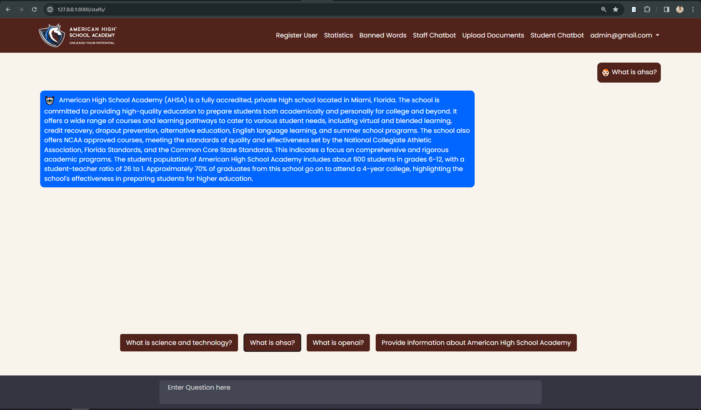
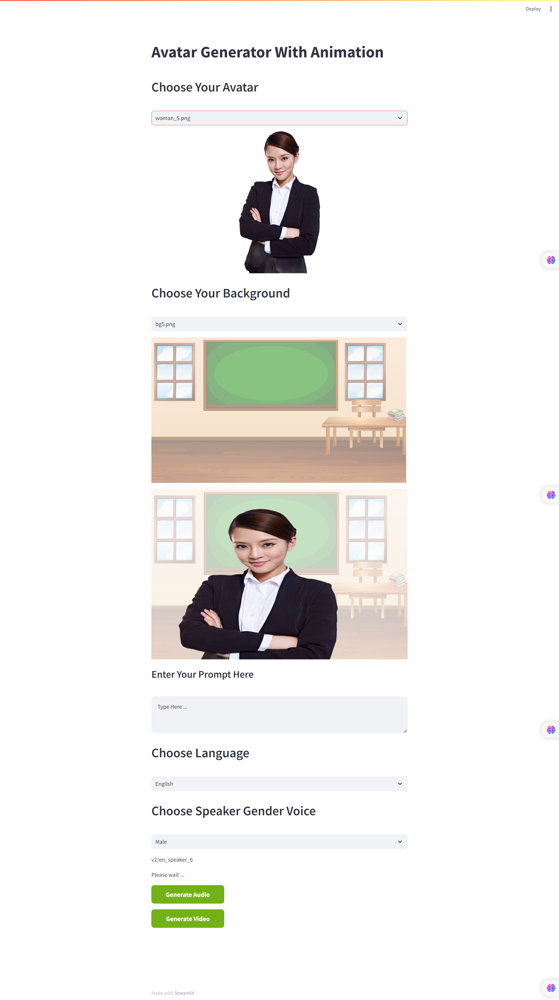
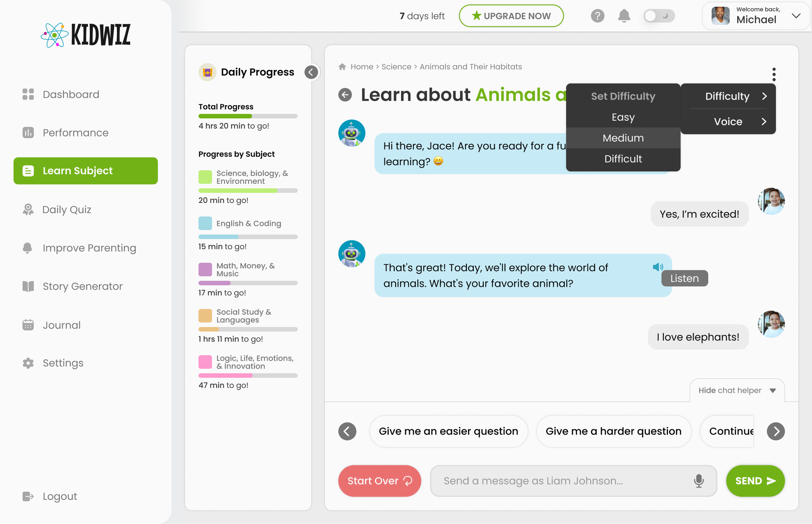

# Mexasol: AI & Web Development Solutions 

 

 

<b>  Welcome to Mexasol, </b> where innovation meets expertise in the realm of Web Designing, Development, and AI Technologies. Join hands with experienced and creative professionals to transform your business vision into digital reality.

# Our Services

### Web Design and Development

- High-end, creative web design and development services
- Tailored solutions to meet your business goals
- Comprehensive e-commerce solutions

### AI, Data Science, ML & DL Services

- Advanced solutions in AI, ML, DL, and Data Science
- Cutting-edge technology for real-world applications
### Digital Marketing
- SEO Services to enhance your online presence
- Top-performing social media and Google AdWords campaigns
- Authentic, transparent strategies for sustained growth

## Why Choose Mexasol?

- Strategic Planning: We strategize plans that align with your business objectives, ensuring high-impact web solutions.
- Expert Team: Our team comprises industry experts who excel in every aspect of web and AI technology.
- Long-term Success: Your success is our priority. We focus on solutions that promise long-term prosperity for your business.

# 🔗 Links

## Projects
#### American High School Academy (AHSA) Chatbot ( yourstuddybuddy.com)

A replica of khanmigo, AI tutor helps children in their home work from history to mathematics and so does other. Leveraging RAG in artificial intelligence that can query from your knowledge base, helping kids in their summer camp

#### AI Avatar GANs

Utilizing Generative ai, where the avatar can answer like a tutor and students can respond with using speech to text technology.

#### KIDWIZ Chatbot

Kidwiz is a platform helping kids to learn subjects having difficulty in their schooling and home schooling. Chatbot helps them to bring ease with 1 on 1 interactions to help understand the weakness in their ability to learn for their parents.
Also, it helps parents to understand their personality trait in this way to help cope with the children ability to learn .

#### Cowin AI Interview

With the advancement in the AI, cowin has utilized the best use case of speech recognition where interviee can answer interviewer query with the help of Grok and deep gram

#### Raiderly 

Raiderly is a tool designed for finding best match investors and influencers for you startup. We leverage the art of prompt engineering and with the help of social engineering, we designed a tool to create a personalized email

# Connect with Us

Experience a new level of digital excellence. Join Mexasol and witness steady growth in your online business endeavors.

For more information and to start your journey with us,[Contact Us](mailto:info@mexasol.com).

# Feedback

If you have any feedback, please reach out to us at info@mexasol.com
